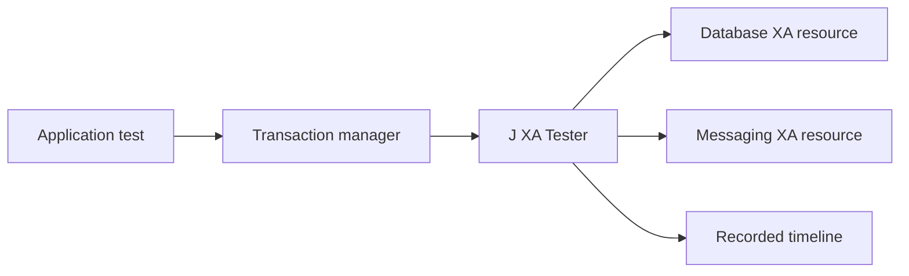

# Meet J XA Tester

## The idea

Distributed transactions are reassuring when everything works and revealing when they do not. An order may be stored in a database while its matching message is on the way to a broker, and XA helps the two systems agree on whether the work should succeed or be undone. The difficult part is gaining confidence in the failure paths. A real database or network problem can be hard to reproduce at exactly the point a test needs it. J XA Tester is a Java 17 testkit that makes those moments predictable, so teams can explore what their transaction-handling code does before production has to teach the lesson.

## What existing tests miss

There are already useful ways to test these systems. A unit test can mock an `XAResource` and quickly verify an application's own decisions, while an integration test with a real database, broker, and transaction manager can show that the full stack works together. Network tools such as Toxiproxy can introduce latency or disconnect a service, and transaction-manager test suites exercise a manager's XA implementation. Each approach answers an important question, but none gives an application test a small, shared way to observe and control a real participant at an exact XA boundary. A mock does not follow the provider's resource through the transaction manager, a real outage may occur before or after the phase under examination, and a network failure alone cannot express every XA outcome.

That gap matters because XA semantics are about sequence as well as failure. Code may need to behave differently when `prepare` rejects a transaction, when `commit` fails after preparation, or when recovery retries work later. Recreating these cases by changing infrastructure, adding timing guesses, or writing a custom wrapper for every test makes scenarios slow and fragile. J XA Tester was built to let an application keep its normal resources and transaction manager while it selects an operation, a before-or-after phase, and a deterministic outcome. It therefore complements mocks, integration environments, network simulation, and transaction-manager testing rather than replacing them.

## J XA Tester

The testkit sits between an application and an existing XA resource. It watches calls such as `start`, `prepare`, `commit`, and recovery operations without needing to know the database query or message body. A test gives the resource a safe, meaningful name, then asks J XA Tester to react when a chosen operation reaches a chosen phase. The reaction can be a synthetic XA exception, a pause, a callback, or a network fault through Toxiproxy. That means a test can reliably say, “make the order database fail just before commit,” instead of hoping a temporary outage arrives at the right millisecond.



J XA Tester works with the XA participant an application already uses. Its core wrapper can decorate any `XAResource`, while dedicated adapters make JDBC XA data sources and Jakarta Messaging XA connection factories easy to instrument. The JUnit 5 extension can create a fresh scenario engine for every test and check that a required fault really happened. This keeps a test honest: if the code never reached the failure point, the test does not quietly pass with an untested recovery path.

After a scenario runs, the recorded timeline provides the story behind it. Rather than guessing whether a resource prepared before a commit failed, a developer can inspect the immutable XA events and see the order directly. Timeline helpers can also wait for an event or verify the sequence from within a test. This is particularly useful when retries, background work, or recovery are involved, because it turns a confusing transaction trace into something the test can describe and verify.

## A fault-injection example

For example, this test wraps the XA resource supplied by an order database and makes its first matching `commit` report that the resource manager failed. The application can then be exercised normally, with its transaction manager receiving the same failure it would receive from an XA participant. The `rule.fired()` check confirms that the scenario reached the intended boundary.

```java
import static javax.transaction.xa.XAException.XAER_RMFAIL;
import static org.junit.jupiter.api.Assertions.assertTrue;

import io.github.rrobetti.xafault.FaultInjectingXAResource;
import io.github.rrobetti.xafault.ResourceKind;
import io.github.rrobetti.xafault.XaAction;
import io.github.rrobetti.xafault.XaRule;
import io.github.rrobetti.xafault.XaRules;
import io.github.rrobetti.xafault.XaOperation;
import io.github.rrobetti.xafault.XaScenarioEngine;
import javax.transaction.xa.XAResource;

XaScenarioEngine engine = new XaScenarioEngine();
XaRule rule = new XaRule(
    XaRules.before("orders-db", XaOperation.COMMIT),
    XaAction.throwException(XAER_RMFAIL));
engine.addRule(rule);

XAResource instrumented = new FaultInjectingXAResource(
    providerXaResource, engine, "orders-db", ResourceKind.JDBC);
transactionManager.enlistResource(instrumented);

assertTrue(rule.fired());
```

## Learn more

The project is intended for testing, not for running transactions in production. It deliberately records structural XA information and an application-selected resource alias, rather than connection credentials, SQL, or message contents. Start with one isolated scenario engine per test, wrap the resources passed to the transaction manager, and add the fault that tells the story you want to understand. From there, J XA Tester makes XA failures less mysterious and gives transaction code a chance to prove that it can recover. The [J XA Tester repository](https://github.com/rrobetti/j-xa-tester) has the source code, complete documentation, and the latest project details.
